# Morpho Twin

**Adaptive digital twin framework for real-time control with online learning and safety guarantees.**

Morpho Twin combines Moving Horizon Estimation (MHE) for parameter identification, dual-control NMPC for optimal control with active learning, and Control Barrier Functions (CBF) for hard safety constraints.

## Features

- **Moving Horizon Estimation** — Online parameter identification with covariance tracking and optional EKF arrival cost
- **Dual-Control NMPC** — Real-Time Iteration (RTI) with Fisher Information probing for active learning
- **CBF Safety Filter** — Quadratic program safety layer with robust margins from parameter uncertainty
- **Supervision System** — Persistence of excitation monitoring and adaptive mode management
- **Causal Correctness** — Stop-gradient boundaries prevent information leakage from future to past

## Installation

```bash
# Clone and install
git clone https://github.com/hadijannat/morpho-twin.git
cd morpho-twin
python -m venv .venv && source .venv/bin/activate
pip install -e ".[dev]"

# Optional backends
pip install -e ".[qp]"      # OSQP for CBF-QP
pip install -e ".[jax]"     # JAX for differentiable components
pip install -e ".[acados]"  # acados for production MHE/NMPC
```

## Quick Start

```bash
# Run simulation with full stack
morpho --config configs/full_demo.yaml

# Run with specific components
morpho --config configs/linear_demo.yaml   # PID + windowed LS
morpho --config configs/mhe_demo.yaml      # MHE + PID
morpho --config configs/nmpc_demo.yaml     # NMPC/RTI
```

## Architecture

```mermaid
%%{init: {'flowchart': {'curve': 'basis'}}}%%
flowchart LR
    subgraph Main Control Loop
        Plant["🏭 Plant"] -->|y| MHE["📊 MHE<br/>Estimator"]
        MHE -->|"θ̂, Σ_θ"| NMPC["🎯 NMPC<br/>Controller"]
        NMPC -->|u_nom| CBF["🛡️ CBF-QP<br/>Safety Filter"]
        CBF -->|u_safe| Plant
    end

    subgraph Supervision
        PE["PE Monitor"] --> Mode["Mode Manager"]
        Mode --> Margin["Margin<br/>Adaptation"]
    end

    MHE -.->|uncertainty| Supervision
    Supervision -.->|margin_factor| CBF
```



### Core Components

| Module | Purpose |
|--------|---------|
| `ddt.estimation` | MHE with CasADi/acados backends, EKF arrival cost, covariance extraction |
| `ddt.control` | NMPC/RTI with dual-control FIM objective |
| `ddt.safety` | CBF-QP filter, barrier functions, robust margins |
| `ddt.supervision` | PE monitoring, mode management (NORMAL/CONSERVATIVE/SAFE_STOP) |
| `ddt.runtime` | Orchestration loop, timing, logging |

## Configuration

All components are configured via YAML:

```yaml
# configs/full_demo.yaml
plant:
  type: linear_scalar
  a_true: 1.02
  b_true: 0.10

estimation:
  type: mhe
  mhe:
    horizon: 20
    use_ekf_arrival_cost: false  # Enable EKF-based arrival cost updating
    solver:
      backend: casadi

control:
  type: nmpc_casadi
  nmpc:
    horizon: 20
    lambda_info: 0.01       # Dual-control probing weight
    fim_criterion: d_optimal  # Options: d_optimal, a_optimal, e_optimal

safety:
  type: cbf_qp
  cbf:
    alpha: 0.5
    slack_weight: 1000.0

supervision:
  enabled: true
  pe:
    window: 100
    lambda_threshold: 0.1
```

## Key Concepts

### Causal Correctness

The control loss must not influence parameter estimates (no future information leaking to the past):

```python
def freeze_theta(theta):
    """Stop-gradient boundary for causal correctness."""
    if isinstance(theta, jax.Array):
        return jax.lax.stop_gradient(theta)
    return np.asarray(theta)
```

### Robust Safety Margins

CBF constraints are tightened based on parameter uncertainty:

```
ε_robust = γ · |∇h| · σ_θ · margin_factor
```

where `σ_θ = √trace(Σ_θθ)` and `margin_factor` adapts with operating mode.

### Dual-Control Objective

NMPC includes Fisher Information to encourage parameter identifiability:

```
J = J_tracking + λ_info · J_FIM
```

where `J_FIM` depends on the selected criterion (configured via `fim_criterion`):
- **D-Optimality** (default): `-log(det(F))` — numerically stable, no matrix inversion
- **A-Optimality**: `tr(F^{-1})` — minimizes average variance
- **E-Optimality**: `1/λ_min(F)` — targets worst-case direction

## Testing

```bash
pytest                           # All tests
pytest tests/unit/               # Unit tests only
pytest tests/integration/        # Integration tests
pytest -k "stop_gradient"        # Causal correctness tests
pytest -k "cbf"                  # Safety filter tests
pytest -k "feedback_suicide"     # Data lineage verification (MHE uses u_applied)
```

## Documentation

- [Architecture](docs/architecture.md) — System design and module overview
- [Acceptance Criteria](docs/acceptance_criteria.md) — Performance requirements

## License

MIT
